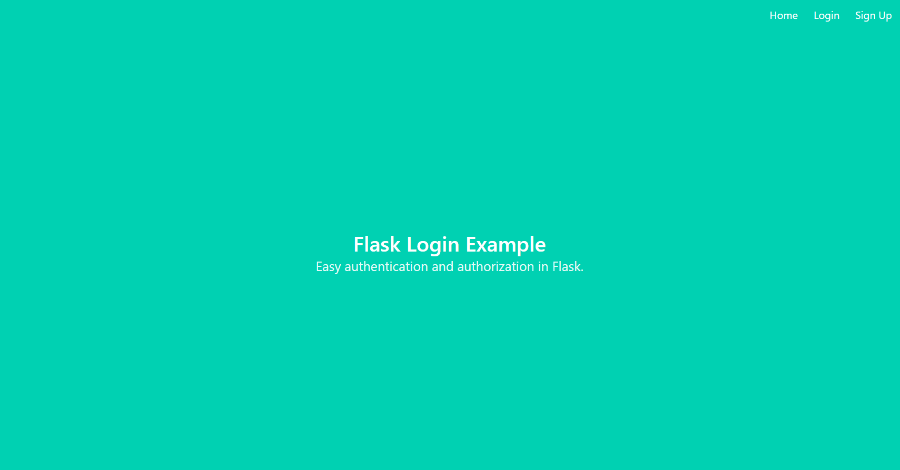
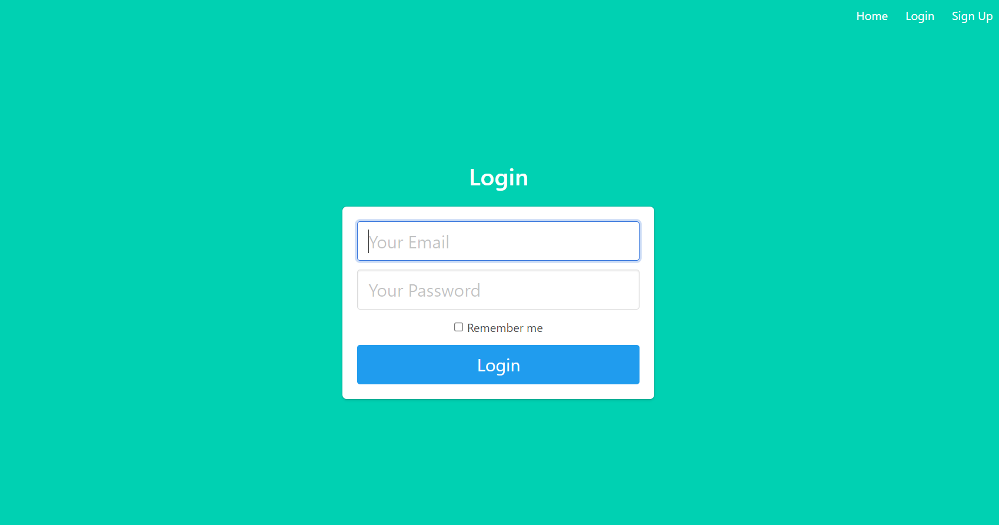
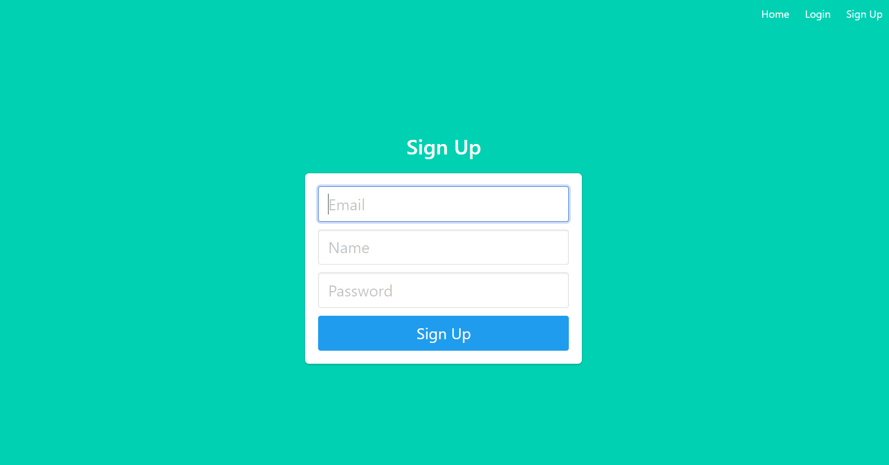

# Modules for Flask
Modules for Flask includes authentication function.

Please type below and run flask app:
~~~
set FLASK_APP=project
set FLASK_DEBUG=1
flask run
~~~

# Screenshots
## Home

## Login

## Login Success

## Sign up

